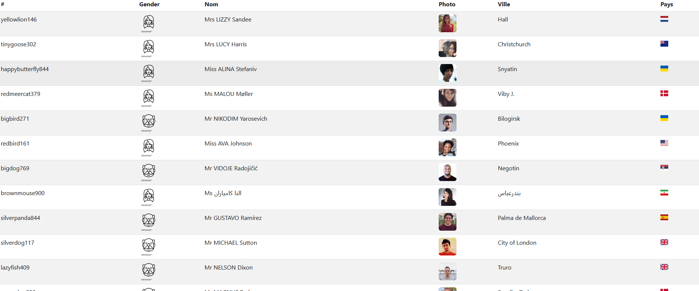
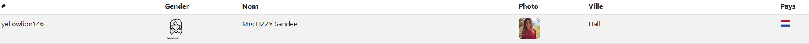

# Affichage de données issues d'une API

A partir d'un fichier de données (au format JSON) fourni, vous devez afficher les informations reçues dans un tableau.

Le tableau sera embelli avec **BootStrap** et vous aurez à afficher des images en fonction du résultat *(icônes différentes selon le genre)*.

## Objectifs / Compétences

> Savoir parcourir un tableau d'objets
	> https://developer.mozilla.org/fr/docs/Learn/JavaScript/Objects/JSON
> Découverte et utilisation de JSON
	> https://developer.mozilla.org/fr/docs/Learn/JavaScript/Objects/JSON
> Utilisation de Fetch
	> https://developer.mozilla.org/fr/docs/Web/API/Fetch_API/Using_Fetch
> Utilisation de console.log console.table
> Notions de requêtes / réponses HTTP

## Langages utilisés

> HTML
> Javascript
> CSS

##  Consignes

- Effectuer une requête sur le site **https://randomuser.me/api/**
	- L'URL à appeler pour ce TP (**endpoint**):
		- https://randomuser.me/api/?results=50
- Parcourir le résultat reçu et l'afficher dans un tableau HTML
- Le tableau doit être embelli en utilisant **Bootstrap**
- Les données à afficher (à minima) sont:
	- username
	- genre *(affichage d'une icône différente selon le genre)*
	- Une concaténation du **titre**, du **nom** et du **prénom**
	- photo
	- ville
	- nom du pays 
	- **drapeau du pays de la nationalité en bonus**

## Bibliothèque utilisée

> Bootstrap
	> https://getbootstrap.com/
> Flag icons
	> https://github.com/lipis/flag-icons

## Travail à rendre

> Envoyer son code via un dépôt GitHub
> Respecter les consignes demandées
> Faire preuve d'originalité!

## Barême

> Respect des consignes     2 pt
> Fonctionnement du code    2 pt
> Clarté et lisibilité      1 pt

> Retard ou non respect des consignes 0

***

## Bonus

> Utiliser des icônes personnalisées
	> https://thenounproject.com/search/icons/

> Afficher le drapeau de la nationalité

> Afficher la météo de la ville
	> https://openweathermap.org/api

## Proposition de solution

- https://github.com/LiliwoL/Javascript-Random-User-API